# Sales Data Warehouse & Advanced Analytics Project

This project builds a clean, analysis-ready dimensional model for a retail sales environment.  
Using customer, product, and sales datasets, the project produces a structured **star schema** suitable for BI dashboards, reporting, and downstream analytics.

---

## 📌 Project Overview

The goal of this project is to design and prepare a high-quality analytics dataset using principles commonly used in business intelligence and data warehousing:

- Dimensional modeling (fact and dimension tables)
- Data cleaning & standardization
- Joining datasets into a unified schema
- Enabling sales performance insights (customer behavior, product trends, revenue patterns)

This dataset can be used as the foundation for Power BI dashboards, SQL analysis, or machine learning experiments.

---

## 🧱 Data Model (Star Schema)

**Fact Table**
- `fact_sales`  
  Contains transactional-level sales information such as order dates, quantities, prices, and revenue.

**Dimension Tables**
- `dim_products`  
  Contains product attributes including category, subcategory, product line, and cost.
- `dim_customers`  
  Contains customer demographics such as name, location, gender, marital status, and birthdate.

```mermaid
erDiagram
    FACT_SALES {
        int order_number
        int product_key
        int customer_key
        date order_date
        date shipping_date
        date due_date
        float sales_amount
        int quantity
        float price
    }
    DIM_PRODUCTS {
        int product_key
        int product_id
        string product_number
        string product_name
        string category
        string subcategory
        string product_line
        float cost
        date start_date
    }
    DIM_CUSTOMERS {
        int customer_key
        int customer_id
        string customer_number
        string first_name
        string last_name
        string country
        string marital_status
        string gender
        date birthdate
        date create_date
    }
    FACT_SALES }o--|| DIM_PRODUCTS : "product_key"
    FACT_SALES }o--|| DIM_CUSTOMERS : "customer_key"
```



---

## 🚀 Getting Started

### Prerequisites
- **SQL Server** (2019 or later recommended)
- **Datasets**: CSV files containing customer, product, and sales data
- File paths configured in the script (default: `C:\sql\sql-data-analytics-project\datasets\csv-files\`)

### Installation & Setup

1. **Clone the repository**
   ```bash
   git clone <repository-url>
   cd sql-data-analytics-project
   ```

2. **Update file paths**
   - Edit `SQLQuery3.sql` to match your local CSV file locations
   - Update paths in the `BULK INSERT` statements

3. **Run the database setup script**
   ```sql
   -- Execute SQLQuery3.sql in SQL Server Management Studio (SSMS)
   -- This will:
   -- 1. Drop and recreate the DataWarehouseAnalytics database
   -- 2. Create the gold schema
   -- 3. Create dimension and fact tables
   -- 4. Load data from CSV files
   ```

⚠️ **WARNING**: Running the setup script will drop the entire `DataWarehouseAnalytics` database if it exists. Ensure you have proper backups before proceeding.

---

## 📊 Analytics Capabilities

This project includes comprehensive SQL analytics organized into several analysis categories:

### 1. **Database Exploration**
- Schema discovery and metadata inspection
- Column-level data type analysis
- Database structure validation

**Key Queries:**
- List all tables in the database
- Inspect column definitions for specific tables
- Understand data types and constraints

### 2. **Dimension Exploration**
- Unique value analysis across dimensions
- Category and hierarchical relationships
- Geographic and demographic distributions

**Example Insights:**
- Countries where customers are located
- Product categories, subcategories, and items
- Customer segmentation by demographics

### 3. **Date Range Analysis**
- Temporal boundary identification
- Historical data span calculation
- Age and tenure analysis

**Key Metrics:**
- Order date range (first to last order)
- Customer age distribution (youngest to oldest)
- Data coverage duration in months

### 4. **Measures Exploration**
Aggregated business metrics for quick insights:

| Metric | Description |
|--------|-------------|
| Total Sales | Sum of all sales revenue |
| Total Quantity | Number of items sold |
| Average Price | Mean selling price per item |
| Total Orders | Count of distinct orders |
| Total Products | Number of unique products |
| Total Customers | Count of registered customers |
| Active Customers | Customers who have placed orders |

**Unified Business Report:**
```sql
-- Generate a single report with all key metrics
SELECT 'Total Sales' AS measure_name, SUM(sales_amount) AS measure_value
FROM gold.fact_sales
UNION ALL ...
```

### 5. **Magnitude Analysis**
Distribution and grouping analysis across dimensions:

- **Customer Analysis**: Distribution by country, gender, marital status
- **Product Analysis**: Count by category, subcategory
- **Financial Analysis**: Average costs per category
- **Revenue Analysis**: Total revenue by category, customer, country
- **Quantity Analysis**: Items sold by geographic region

**Use Cases:**
- Identify high-value customer segments
- Understand product portfolio composition
- Discover geographic revenue concentrations

### 6. **Ranking Analysis**
Performance-based rankings using window functions:

**Top Performers:**
- Top 5 revenue-generating products
- Top 10 highest-value customers
- Best-performing categories

**Bottom Performers:**
- 5 worst-selling products
- 3 customers with fewest orders
- Underperforming product lines

**Ranking Techniques:**
- Simple `TOP N` queries
- Advanced window functions (`RANK()`, `DENSE_RANK()`, `ROW_NUMBER()`)
- Flexible ranking with partition clauses

### 7. **Time-Series Analysis**
Track trends and patterns over time:

**Temporal Aggregations:**
- Monthly/yearly sales performance
- Customer acquisition over time
- Quantity sold by period

**Date Functions Used:**
- `YEAR()`, `MONTH()` for quick extraction
- `DATETRUNC()` for period standardization
- `FORMAT()` for custom date displays

**Example Output:**
```
| Order Date | Total Sales | Total Customers | Total Quantity |
|------------|-------------|-----------------|----------------|
| 2023-Jan   | $125,430    | 342             | 1,245          |
| 2023-Feb   | $138,920    | 389             | 1,567          |
```

### 8. **Cumulative Analysis**
Running totals and moving averages:

- **Running Total Sales**: Cumulative revenue over time
- **Moving Average Price**: Smoothed price trends
- **Growth Tracking**: Long-term performance monitoring

**Window Functions:**
```sql
SUM(total_sales) OVER (ORDER BY order_date) AS running_total_sales
AVG(avg_price) OVER (ORDER BY order_date) AS moving_average_price
```

### 9. **Year-over-Year (YoY) Performance**
Compare current vs. previous period performance:

**Key Comparisons:**
- Current sales vs. previous year
- Performance vs. product average
- Trend identification (Increase/Decrease/No Change)

**Analysis Components:**
- Average sales by product across all years
- Difference from average (Above/Below/At Average)
- Year-over-year change using `LAG()` function
- Trend classification with `CASE` statements

**Business Value:**
- Identify growing vs. declining products
- Benchmark against historical performance
- Forecast future trends

### 10. **Data Segmentation**
Group data into meaningful business categories:

**Product Segmentation:**
- Cost ranges (Below 100, 100-500, 500-1000, Above 1000)
- Product count by segment

**Customer Segmentation:**
Three-tier classification system:

| Segment | Criteria |
|---------|----------|
| **VIP** | ≥12 months lifespan AND >€5,000 spending |
| **Regular** | ≥12 months lifespan AND ≤€5,000 spending |
| **New** | <12 months lifespan |

**Segmentation Benefits:**
- Targeted marketing campaigns
- Customized customer experiences
- Product portfolio optimization
- Inventory management insights

### 11. **Part-to-Whole Analysis**
Understand component contributions to totals:

**Category Contribution:**
- Calculate each category's share of total sales
- Percentage of overall revenue
- Identify dominant categories

**Formula:**
```sql
(Category Sales / Total Sales) × 100 = Percentage of Total
```

**Business Applications:**
- Resource allocation decisions
- Strategic planning
- Portfolio balancing
- Performance benchmarking

---

## 📈 Advanced Reporting Views

The project includes two pre-built analytical views for streamlined reporting:

### Customer Report (`gold.report_customers`)

Comprehensive customer-level analytics view containing:

**Core Fields:**
- Customer identification (key, number, name)
- Demographics (age, age group)
- Segmentation (VIP, Regular, New)

**Behavioral Metrics:**
- Total orders placed
- Total sales revenue
- Total quantity purchased
- Distinct products purchased
- Customer lifespan (months)

**Calculated KPIs:**
- **Recency**: Months since last order
- **Average Order Value (AOV)**: Total sales ÷ Total orders
- **Average Monthly Spend**: Total sales ÷ Lifespan

**Use Cases:**
- Customer retention analysis
- Lifetime value (LTV) calculations
- Churn prediction
- Personalized marketing campaigns

### Product Report (`gold.report_products`)

Comprehensive product-level analytics view containing:

**Core Fields:**
- Product identification (key, name)
- Categorization (category, subcategory)
- Cost information

**Performance Metrics:**
- Total orders received
- Total sales revenue
- Total quantity sold
- Unique customers served
- Product lifespan (months)
- Average selling price

**Performance Segmentation:**
| Segment | Criteria |
|---------|----------|
| **High-Performer** | Total sales > €50,000 |
| **Mid-Range** | Total sales €10,000-€50,000 |
| **Low-Performer** | Total sales < €10,000 |

**Calculated KPIs:**
- **Recency**: Months since last sale
- **Average Order Revenue (AOR)**: Total sales ÷ Total orders
- **Average Monthly Revenue**: Total sales ÷ Lifespan

**Use Cases:**
- Product performance monitoring
- Inventory optimization
- Pricing strategy analysis
- Product lifecycle management
- SKU rationalization

### Using the Views

```sql
-- Query customer insights
SELECT * FROM gold.report_customers
WHERE customer_segment = 'VIP'
ORDER BY total_sales DESC;

-- Query product performance
SELECT * FROM gold.report_products
WHERE product_segment = 'High-Performer'
AND recency_in_months <= 3
ORDER BY avg_monthly_revenue DESC;
```

---

## 🔍 Sample Queries

### Basic Metrics
```sql
-- Get overall business performance
SELECT 
    SUM(sales_amount) AS total_revenue,
    COUNT(DISTINCT order_number) AS total_orders,
    COUNT(DISTINCT customer_key) AS total_customers
FROM gold.fact_sales;
```

### Customer Insights
```sql
-- Top 10 customers by revenue
SELECT TOP 10
    c.first_name + ' ' + c.last_name AS customer_name,
    SUM(f.sales_amount) AS total_revenue
FROM gold.fact_sales f
LEFT JOIN gold.dim_customers c ON c.customer_key = f.customer_key
GROUP BY c.first_name, c.last_name
ORDER BY total_revenue DESC;
```

### Product Performance
```sql
-- Revenue by product category
SELECT 
    p.category,
    SUM(f.sales_amount) AS category_revenue,
    COUNT(DISTINCT f.order_number) AS total_orders
FROM gold.fact_sales f
LEFT JOIN gold.dim_products p ON p.product_key = f.product_key
GROUP BY p.category
ORDER BY category_revenue DESC;
```

### Time-Series Analysis
```sql
-- Monthly sales trend
SELECT 
    FORMAT(order_date, 'yyyy-MM') AS month,
    SUM(sales_amount) AS monthly_sales,
    COUNT(DISTINCT customer_key) AS active_customers
FROM gold.fact_sales
WHERE order_date IS NOT NULL
GROUP BY FORMAT(order_date, 'yyyy-MM')
ORDER BY month;
```

---

## 📁 Project Structure

```
sql-data-analytics-project/
│
├── datasets/
│   └── csv-files/
│       ├── gold.dim_customers.csv
│       ├── gold.dim_products.csv
│       └── gold.fact_sales.csv
│
├── SQLQuery3.sql              # Main database setup & analytics script
├── README.md                  # Project documentation
└── .gitignore
```

---

## 🛠️ Technical Details

### SQL Techniques Demonstrated

1. **Data Definition Language (DDL)**
   - Database and schema creation
   - Table creation with appropriate data types
   - View creation for reporting

2. **Data Manipulation**
   - Bulk insert operations
   - Data truncation and reloading

3. **Aggregation Functions**
   - `SUM()`, `COUNT()`, `AVG()`, `MIN()`, `MAX()`
   - `COUNT(DISTINCT)` for unique values

4. **Window Functions**
   - `RANK()`, `DENSE_RANK()`, `ROW_NUMBER()`
   - `LAG()` for previous period comparisons
   - `SUM() OVER()` for running totals
   - `AVG() OVER()` for moving averages
   - Partitioning with `PARTITION BY`

5. **Date Functions**
   - `DATETRUNC()`, `DATEPART()`, `FORMAT()`
   - `DATEDIFF()` for period calculations
   - `YEAR()`, `MONTH()` for extraction

6. **Advanced SQL Patterns**
   - Common Table Expressions (CTEs)
   - Subqueries in FROM clause
   - UNION ALL for combining results
   - Complex CASE statements
   - Self-referential comparisons

7. **Joins**
   - LEFT JOIN for preserving fact records
   - Multiple table joins
   - Conditional join logic

---

## 📊 Key Performance Indicators (KPIs)

This project enables tracking of critical business metrics:

### Revenue Metrics
- Total Sales Revenue
- Average Order Value (AOV)
- Revenue by Category/Product/Customer
- Monthly Revenue Trends

### Customer Metrics
- Total Customers
- Active Customers (with orders)
- Customer Lifetime Value (CLV)
- Customer Acquisition by Period
- Recency, Frequency, Monetary (RFM) scores

### Product Metrics
- Total Products Available
- Products Sold
- Average Selling Price
- Product Performance Rankings
- Category Contribution

### Operational Metrics
- Total Orders
- Items Sold (Quantity)
- Order Fulfillment Patterns
- Geographic Distribution

---

## 🎯 Use Cases

This data warehouse supports various analytical scenarios:

1. **Executive Dashboards**: High-level KPIs and trends
2. **Marketing Analysis**: Customer segmentation and targeting
3. **Sales Performance**: Territory and product analysis
4. **Inventory Planning**: Product demand patterns
5. **Financial Reporting**: Revenue recognition and forecasting
6. **Customer Success**: Retention and churn analysis

---

## ⚠️ Important Notes

- The database setup script is **destructive** - it will drop existing data
- File paths must be updated to match your local environment
- Ensure SQL Server has permission to access the CSV file locations
- All monetary values are assumed to be in Euro (€)
- Date formats should match SQL Server expectations (YYYY-MM-DD)

---

## 🔜 Future Enhancements

Potential areas for expansion:

- [ ] Add time dimension table for more sophisticated date analysis
- [ ] Implement slowly changing dimensions (SCD Type 2)
- [ ] Create additional calculated measures in views
- [ ] Add data quality checks and validation scripts
- [ ] Develop stored procedures for automated refresh
- [ ] Integrate with Power BI for visualization
- [ ] Add geographic dimension for deeper location analysis
- [ ] Implement incremental loading strategies

---

## 📚 Learning Resources

This project demonstrates concepts from:
- Data warehousing and dimensional modeling (Kimball methodology)
- SQL Server T-SQL programming
- Business intelligence and analytics
- Window functions and advanced SQL techniques

---

## 🤝 Contributing

Contributions are welcome! Areas for improvement:
- Query optimization
- Additional analytical patterns
- Documentation enhancements
- Example visualizations

---

## 📄 License

This project is available for educational and commercial use.

---

## 👤 Author

**Your Name**
- GitHub: [@irfanroscoe](https://github.com/irfanroscoe)
- LinkedIn:

---

## 🙏 Acknowledgments
- Inspired by real-world data warehousing best practices
- Built using Microsoft SQL Server
- Follows dimensional modeling principles from industry standards
